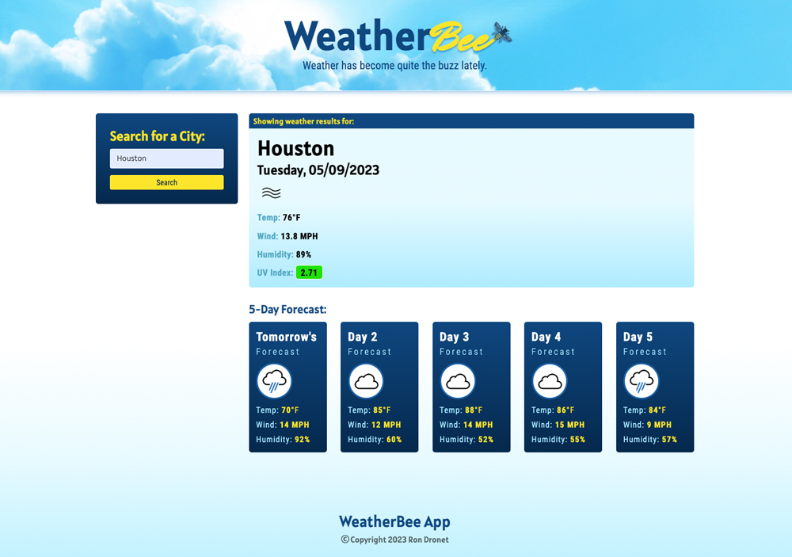

# weather-bee
The weather has been quite the buzz lately! Find out why on WeatherBee

## Purpose:
Fun and easy way to check out the weather if you're going to travel or have outdoor activities planned.

 

     

 

## Viewable Responsive Screen Sizes:
* Desktop: 2000px
* Media Query Sizes:
  - 1189px (Desktop - laptops)
  - 768px (Laptop - tablets)
  - 575px (Small devices - large cell phones)

## Website Link:
https://dronetdevdesign.github.io/weather-bee/

## This Website Created Using:
* JavaScript
* DayJS
* GoogleFonts
* HTML
* CSS

## Graphic Software Used:
* Adobe Photoshop:

## Contribution:
Ron Dronet - Full-stack Developer and Graphic Designer
